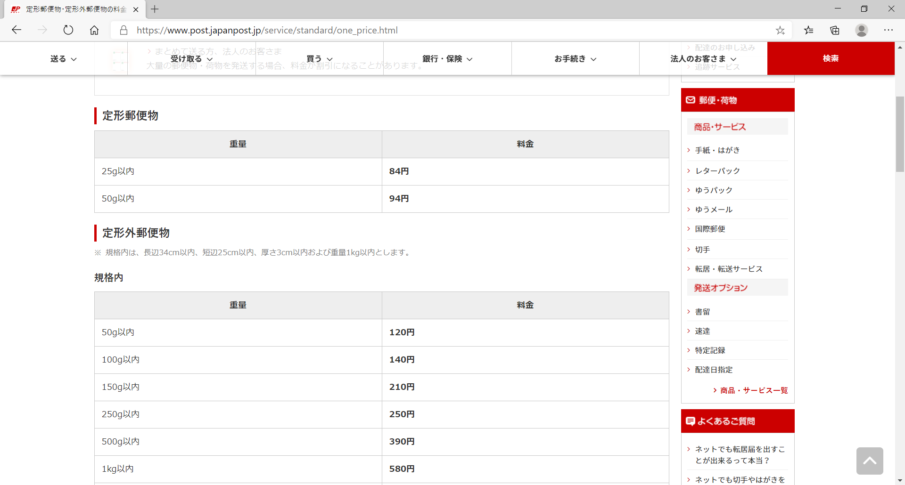

# 事務関連マニュアル
## 休日出勤について
明日の昼までに上長と相談の上、社長に申請します。

**休日出勤のタイムカードの打刻漏れ**には特に注意してください。最悪、認められないケースも発生するので、慎重に対応をお願いします。

## 経費の精算について
主な適用項目は次の通りです。
- 資料代
- 通信費
- 消耗品費

|適用 |内容
|--|--
|資料代 |資料本 有料アプリ
|通信費 |切手 宅配便料金
|消耗品費 |文具 台所用品

## 宅急便の発送について
## 電話、来客対応について
## ゴミ収集について
## プリンタについて
###プリンタドライバのインストール
ダウンロード(https://example.com/printer_driver)よりOSに合わせたドライバをダウンロードしてください。

macOSではシステム環境設定の「プリンタとスキャナ」を開き、「+」ボタンをクリックしてプリンタを追加します。

## 大容量データの送受信について
